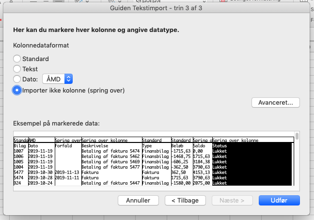
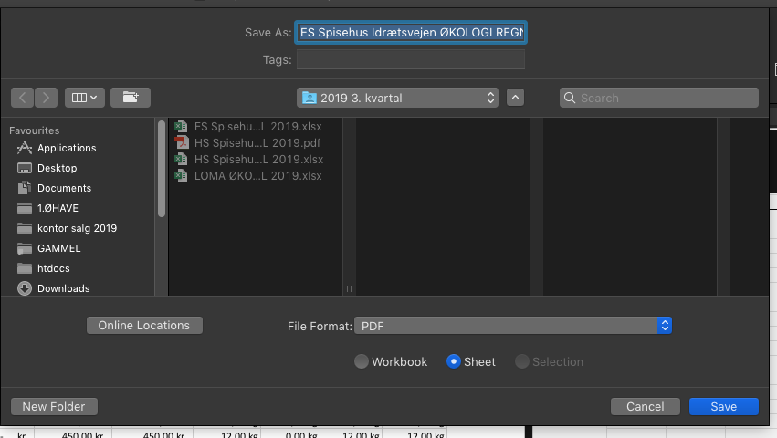

# Økologi regnskab
Excel ark til udarbejdelse af økorapport. Excelark med indirect funktion, som på baggrund af faktura nummer aflæser fanernes indhold. 

Arket er tilgængeligt her, tryk download til højre: [LINK](https://github.com/andershoejlund/okorapport/blob/e6aa1ea7a3c40e9fc0b9a1fca43e6a2be66212d3/EKSEMPEL%20%C3%98KOLOGI%20REGNSKAB.xlsx)

# Vejledning:

- Find kunden på kontakt listen: [https://app.dinero.dk/197800/contacts](https://app.dinero.dk/197800/contacts)
- Under kontoudtog, sæt perioden, eksporter CSV.
- Import som text, vælg semikolon:

Tryk på de forskellige kolonner og vælg den rette tilhørende værdi

- CSV, slet betalinger(finansbilag) kopier værdier fra faktura nummer + dato + beløb
- Find øhave/økologi regnskab/ excel lave kopi
- Åben alle relevante fakturaer fra dinero

  💡 Husk at undlade fragt, så den ikke bliver regnet med.

- kopier solgte varer ind i excel på hver fane (rimelig dårlig forklaring, det handler om at få kopieret vare linjerne ind i excel således at total antal kilo kan beregnes)
    
  💡  jeg bruger firefox, der fungerer kopieringen lettest for mig
    
- Navngiv fanen med fakuranummer

  💡  Husk at ændre øhave kontor varer fra antal kasser til kilo, brug minimums vægt, se webshoppen.
    
- Eksporter PDF fra excel, husk at ændre kvartal perioden under **sidehoved og gem kun ark (se herunder)**

